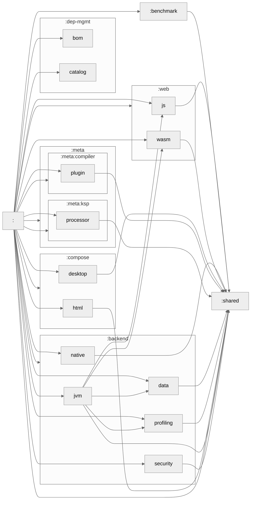

🎨 Kotlin Multiplatform Playground!
----------

[![GitHub Workflow Status][gha_badge]][gha_url]
[![OpenJDK Version][java_img]][java_url]
[![Kotlin release][kt_img]][kt_url]
[![Maven Central Version][maven_img]][maven_url]
[![Ktor][ktor_img]][ktor_url]
[![Compose MP][cmp_img]][cmp_url]
[![Style guide][ktfmt_img]][ktfmt_url]

This repo shows a Gradle multi-project build structure that uses the [Kotlin Multiplatform][Kotlin Multiplatform] to
build a [JVM][Kotlin-JVM], [JS][Kotlin-JS], [Desktop][Compose-Multiplatform]
and [Compose Web (wasm)][Compose-Multiplatform] applications.

### Install OpenJDK EA Build

```bash
# Mac OS
$ curl -s "https://get.sdkman.io" | bash
$ sdk i java 24.ea-open
$ sdk u java 24.ea-open
```

### Build & Run

```bash
$ ./gradlew build [-Pskip.test]
# Run the app
$ ./gradlew :backend:jvm:run
```

<details>
<summary> <b>Multiplatform Targets</b></summary>

### JVM

* Build and Run

  ```bash
  $ ./gradlew :backend:jvm:run
  $ ./gradlew :backend:jvm:build
  $ ./gradlew :backend:jvm:jdeprscan
  $ ./gradlew :backend:jvm:printModuleDeps
  $ ./gradlew :shared:jvmRun

  # Benchmark
  $ ./gradlew :benchmark:benchmark
  ```
* GraalVM Native Image

  ```bash
  $ sdk u java graalvm-ce-dev
  $ ./gradlew :backend:jvm:nativeCompile
  $ backend/jvm/build/native/nativeCompile/jvm

  # To generate the native image configurations
  $ ./gradlew :backend:jvm:run -Pagent
  $ curl http://localhost:8080/shutdown
  $ ./gradlew :backend:jvm:metadataCopy

  ```

* Containers

  ```bash
  $ docker run \
           -it \
           --rm \
           --pull always \
           --workdir /app \
           --publish 8080:8080 \
           --publish 8081:8081 \
           --name kotlin-mpp-playground \
           --mount type=bind,source=$(pwd),destination=/app,readonly \
           openjdk:24-slim /bin/bash -c "printenv && nohup jwebserver -b 0.0.0.0 -p 8081 -d / & backend/jvm/build/libs/jvm-app"

   $ ./gradlew :backend:jvm:jibDockerBuild
   $ docker run -it --rm --name jvm-app -p 8080:8080 -p 9898:9898 sureshg/jvm
   $ docker stats
  ```

* OpenTelemetry

  ```bash
   # Install otel-desktop-viewer or Jaeger
   $ brew tap CtrlSpice/homebrew-otel-desktop-viewer
   $ brew install otel-desktop-viewer
   $ otel-desktop-viewer


   # or run the Jaeger collector
   $ docker run -it --rm --pull=always \
                -e COLLECTOR_OTLP_ENABLED=true \
                -p 4317:4317 \
                -p 16686:16686 \
                jaegertracing/all-in-one:latest
   $ open http://localhost:16686

   # Run the app
   $ docker run -it --rm \
                --name jvm \
                -p 8080:8080 \
                -p 9898:9898 \
                -e OTEL_JAVAAGENT_ENABLED=true \
                -e OTEL_TRACES_EXPORTER="otlp" \
                -e OTEL_EXPORTER_OTLP_PROTOCOL="grpc" \
                -e OTEL_EXPORTER_OTLP_ENDPOINT="http://host.docker.internal:4317" \
                sureshg/jvm:latest
   $ curl -v -X GET http://localhost:8080/trace

   # Change/Reset log level
   $ curl -v -X POST http://localhost:8080/loglevel/dev.suresh.http/debug
   $ curl -v -X POST http://localhost:8080/loglevel/reset
  ```

* AppCDS

  ```bash
  # Run with AppCDS
  $ java -Xlog:class+load:file=/tmp/cds.log:uptime,level,tags,pid \
         -XX:+AutoCreateSharedArchive \
         -XX:SharedArchiveFile=/tmp/app.jsa \
         -jar backend/jvm/build/libs/jvm-all.jar

  # cds-log-parser.jar --logFile=/tmp/cds.log
  ```

* Tests

  ```bash
  $ ./gradlew :backend:jvm:test -PktorTest
  $ ./gradlew :backend:jvm:test -Pk8sTest
  $ ./gradlew :backend:jvm:jvmRun -DmainClass=dev.suresh.lang.SysCallKt --quiet
  ```

* Binary Compatibility

  ```bash
  $ ./gradlew :backend:security:apiDump
  $ ./gradlew :backend:security:apiCheck
  ```

### Wasm/JS

  ```bash
  $ ./gradlew :web:jsBrowserProductionRun -t
  $ ./gradlew :web:wasmJsBrowserProductionRun -t
  $ ./gradlew kotlinUpgradePackageLock

  # Kobweb
  $ kobweb run -p compose/web
  $ ./gradlew :compose:html:kobwebStart -t
  $ ./gradlew :compose:html:kobwebStop
  ```

### Native

  ```bash
  $ ./gradlew :backend:native:build
  # Arch specific binaries
  $ ./gradlew :backend:native:macosArm64Binaries
  $ ./gradlew :backend:native:macosX64Binaries
  $ ./gradlew :backend:native:macOsUniversalBinary

  # Native container image
  $ ./gradlew :backend:native:jibDockerBuild
  $ docker run -it --rm --name native-app sureshg/native

  # Debug distroless image
  # docker run -it --entrypoint=sh gcr.io/distroless/cc-debian12:debug

  # Test linux binary on ARM64 MacOS
  $ ./gradlew :backend:native:linuxArm64Binaries
  $ docker run  \
           -it \
           --rm \
           --publish 8080:80 \
           --mount type=bind,source=$(pwd),destination=/app,readonly \
           debian:stable-slim
    # /app/backend/native/build/bin/linuxArm64/releaseExecutable/native.kexe
    # libtree -v /app/backend/native/build/bin/linuxArm64/releaseExecutable/native.kexe

  # Build native binaries on container
  $ docker run \
           --platform=linux/amd64 \
           -it \
           --rm \
           --pull always \
           --workdir /app \
           --name kotlin-native-build \
           --mount type=bind,source=$(pwd),destination=/app \
           --mount type=bind,source=${HOME}/.gradle,destination=/root/.gradle \
           openjdk:24-slim /bin/bash
  # apt update && apt install libtree tree
  # ./gradlew --no-daemon :backend:native:build
  #  backend/native/build/bin/linuxX64/releaseExecutable/native.kexe
  ```

### Compose

  ```bash
  # Compose Desktop
  $ ./gradlew :compose:cmp:runDistributable
  $ ./gradlew :compose:cmp:packageDistributionForCurrentOS
  $ ./gradlew :compose:cmp:suggestModules

  # Compose Web
  $ ./gradlew :compose:cmp:wasmJsBrowserProductionRun -t
  ```

### Publishing

  ```bash
  $ ./gradlew publishAllPublicationsToLocalRepository

  # Publishing to all repo except Central
  $ ./gradlew buildAndPublish

  # Maven Central Publishing
  # https://central.sonatype.org/publish/publish-portal-gradle/#alternatives
  # https://vanniktech.github.io/gradle-maven-publish-plugin/central/#in-memory-gpg-key
  $ gpg --export-secret-keys --armor XXXXXXXX | grep -v '\-\-' | grep -v '^=.' | tr -d '\n'
  # OR
  $ gpg --export-secret-keys --armor XXXXXXXX | awk 'NR == 1 { print "SIGNING_KEY=" } 1' ORS='\\n'

  $ export ORG_GRADLE_PROJECT_mavenCentralUsername=<Username from https://central.sonatype.com/account>
  $ export ORG_GRADLE_PROJECT_mavenCentralPassword=<Token from https://central.sonatype.com/account>
  $ export ORG_GRADLE_PROJECT_signingKeyId=<GPG Key ID>
  $ export ORG_GRADLE_PROJECT_signingPassword=<Password>
  $ export ORG_GRADLE_PROJECT_signingKey=$(gpg --export-secret-keys --armor ${ORG_GRADLE_PROJECT_signingKeyId} | grep -v '\-\-' | grep -v '^=.' | tr -d '\n')

  $ ./gradlew publishAggregatedPublicationToCentralPortal
  # For all publications,
  $ ./gradlew publishAllPublicationsToCentralPortal
  ```

### Misc

  ```bash
  # Dependency Insight
  $ ./gradlew dependencies
  $ ./gradlew :shared:dependencies --configuration testRuntimeClasspath
  $ ./gradlew -q :shared:dependencyInsight --dependency slf4j-api --configuration RuntimeClasspath
  $ ./gradlew :backend:jvm:listResolvedArtifacts

  # KMP hierarchy and module graphs
  $ ./gradlew :shared:printHierarchy
  $ ./gradlew createModuleGraph
  $ ./gradlew generateChangelog

  # Clean
  $ ./gradlew cleanAll

  # Gradle Daemon Toolchain
  $ ./gradlew updateDaemonJvm

  # Gradle Best Practices
  $ ./gradlew -p gradle/build-logic :bestPracticesBaseline
  $ ./gradlew checkBuildLogicBestPractices

  # GitHub Actions lint
  $ actionlint

  # ToDo
  # Enable es2015 for configureKotlinJs
  ```

</details>

### Deployed App and Docs

- [Web App](https://suresh.dev/kotlin-mpp-playground/app/)
- [Docs](https://suresh.dev/kotlin-mpp-playground/docs)
- [Coverage](https://suresh.dev/kotlin-mpp-playground/reports)
- [Tests](https://suresh.dev/kotlin-mpp-playground/tests)

### Resources

- [🔍 Kotlin Multiplatform Package Search](https://package-search.jetbrains.com/search?query=ktor&onlyMpp=true)
- [🎨 Kotlin Multiplatform Wizard](https://kmp.jetbrains.com/)
- [📏 Jetbrains Compose Rules](https://mrmans0n.github.io/compose-rules/rules/)

<!-- Badges -->

[java_url]: https://jdk.java.net/24/

[java_img]: https://img.shields.io/badge/OpenJDK-24-e76f00?logo=openjdk&logoColor=e76f00

[kt_url]: https://github.com/JetBrains/kotlin/releases/latest

[kt_img]: https://img.shields.io/github/v/release/Jetbrains/kotlin?include_prereleases&color=7f53ff&label=Kotlin&logo=kotlin&logoColor=7f53ff

[maven_img]: https://img.shields.io/maven-central/v/dev.suresh.kmp/shared?logo=apachemaven&logoColor=cd2237&color=cd2237

[maven_url]: https://central.sonatype.com/search?q=dev.suresh.kmp&namespace=dev.suresh.kmp

[maven_dl]: https://search.maven.org/remote_content?g=dev.suresh.kmp&a=shared&v=LATEST

[gha_url]: https://github.com/sureshg/kotlin-mpp-playground/actions/workflows/build.yml

[gha_badge]: https://img.shields.io/github/actions/workflow/status/sureshg/kotlin-mpp-playground/build.yml?branch=main&color=green&label=Build&logo=Github-Actions&logoColor=green

[sty_url]: https://kotlinlang.org/docs/coding-conventions.html

[sty_img]: https://img.shields.io/badge/style-Kotlin--Official-40c4ff.svg?style=for-the-badge&logo=kotlin&logoColor=40c4ff

[ktfmt_url]: https://github.com/facebookincubator/ktfmt#ktfmt

[ktfmt_img]: https://img.shields.io/badge/code%20style-%E2%9D%A4-FF4081.svg?logo=kotlin&logoColor=FF4081

[cmp_url]: https://github.com/JetBrains/compose-multiplatform/releases

[cmp_img]: https://img.shields.io/github/v/release/JetBrains/compose-multiplatform?color=3cdc84&label=Compose%20MP&logo=JetpackCompose&logoColor=3cdc84

[kobweb_url]: https://github.com/varabyte/kobweb/releases

[kobweb_img]: https://img.shields.io/github/v/release/varabyte/kobweb?color=1985f2&include_prereleases&label=Kobweb&logo=Github&logoColor=1985f2

[ktor_url]: https://search.maven.org/artifact/io.ktor/ktor-bom

[ktor_download]: https://search.maven.org/remote_content?g=io.ktor&a=ktor-client&v=LATEST

[ktor_img]: https://img.shields.io/maven-central/v/io.ktor/ktor-bom?color=4a79fe&label=Ktor&logo=data:image/svg+xml;base64,PHN2ZyB3aWR0aD0iMTYiIGhlaWdodD0iMTYiIHZlcnNpb249IjEuMSIgdmlld0JveD0iMCAwIDE2IDE2IiB4bWxucz0iaHR0cDovL3d3dy53My5vcmcvMjAwMC9zdmciPgogIDxkZWZzPgogICAgPHN0eWxlPi5he2ZpbGw6bm9uZTt9LmJ7Y2xpcC1wYXRoOnVybCgjYSk7fS5je2ZpbGw6I2ZmZjt9PC9zdHlsZT4KICAgIDxjbGlwUGF0aCBpZD0iYSI+CiAgICAgIDxyZWN0IGNsYXNzPSJhIiB4PSIxNC43IiB5PSIxMSIgd2lkdGg9IjE3MSIgaGVpZ2h0PSIxNTEiLz4KICAgIDwvY2xpcFBhdGg+CiAgICA8Y2xpcFBhdGggaWQ9ImNsaXBQYXRoMTMiPgogICAgICA8cmVjdCBjbGFzcz0iYSIgeD0iMTQuNyIgeT0iMTEiIHdpZHRoPSIxNzEiIGhlaWdodD0iMTUxIi8+CiAgICA8L2NsaXBQYXRoPgogIDwvZGVmcz4KICA8cGF0aCBjbGFzcz0iYyIgdHJhbnNmb3JtPSJtYXRyaXgoLjE2NCAwIDAgLjE2NCAtOC4zNyAtMS44MSkiIGQ9Im0xMDAgMTEtNDIuMyAyNC40djQ4LjlsNDIuMyAyNC40IDQyLjMtMjQuNHYtNDguOXptMzAuMiA2Ni4zLTMwLjIgMTcuNC0zMC4yLTE3LjR2LTM0LjlsMzAuMi0xNy40IDMwLjIgMTcuNHoiIGNsaXAtcGF0aD0idXJsKCNjbGlwUGF0aDEzKSIvPgo8L3N2Zz4K

[Kotlin-JVM]: https://kotlinlang.org/docs/jvm-get-started.html

[Kotlin-JS]: https://kotlinlang.org/docs/js-project-setup.html

[Kotlin Multiplatform]: https://kotlinlang.org/docs/multiplatform.html

[Compose-Multiplatform]: https://github.com/JetBrains/compose-multiplatform

[Kotlin Multiplatform DSL]: https://kotlinlang.org/docs/multiplatform-dsl-reference.html

[simple-icons-logo]: https://simpleicons.org/icons/kotlin.svg


<details>
<summary>Module Dependency Graph</summary>

### Module Dependency



</details>
