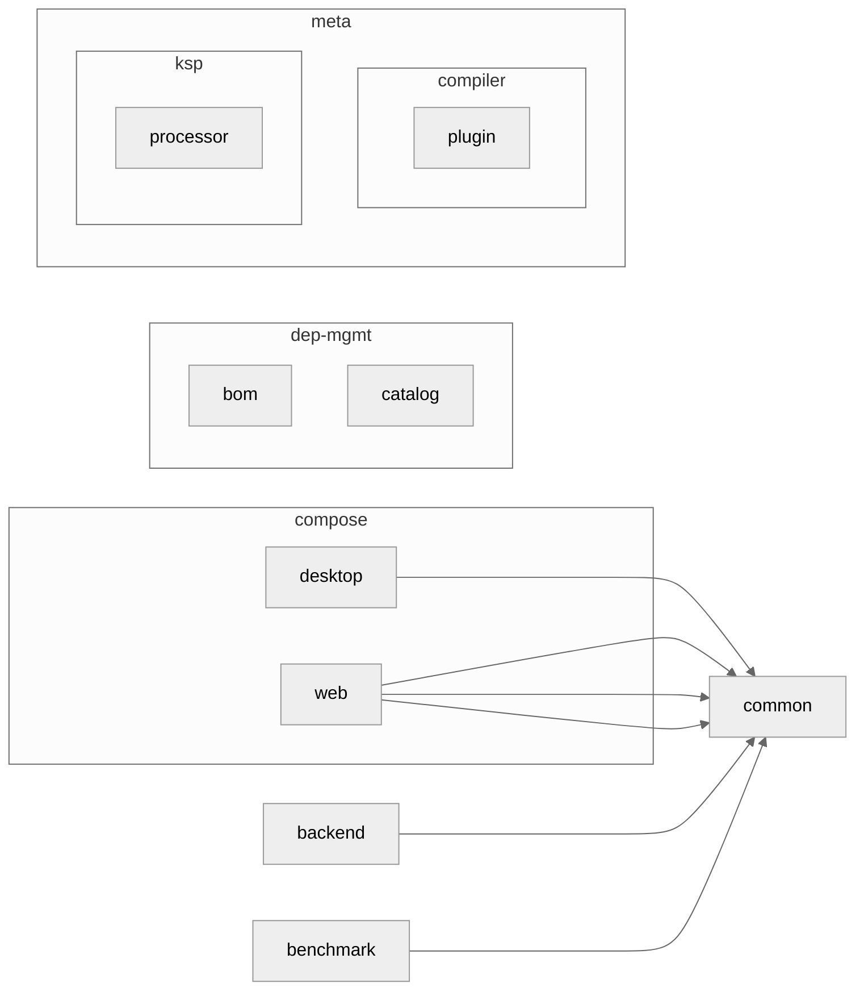

Kotlin Multiplatform Playground!
----------

[![GitHub Workflow Status][gha_badge]][gha_url]
[![OpenJDK Version][java_img]][java_url]
[![Kotlin release][kt_img]][kt_url]
[![Ktor][ktor_img]][ktor_url]
[![Compose Multiplatform][cmp_img]][cmp_url]
[![Kobweb][kobweb_img]][kobweb_url]
[![Style guide][ktfmt_img]][ktfmt_url]

This repo shows a Gradle multi-project build structure that uses the [Kotlin Multiplatform][Kotlin Multiplatform] to
build a [JVM][Kotlin-JVM], [JS][Kotlin-JS], [Desktop][Compose-Multiplatform]
and [Compose Web (wasm)][Compose-Multiplatform] applications.

### Install OpenJDK EA Build

```bash
# Mac OS
$ curl -s "https://get.sdkman.io" | bash
$ sdk i java 22.ea-open
$ sdk u java 22.ea-open
```

### Build & Run

```bash
$ ./gradlew buildAndPublish
```

<details>
<summary>Run Modules</summary>

```bash
$ ./gradlew :common:run
$ ./gradlew :backend:run
$ ./gradlew :web:jsBrowserProductionRun -t

# Publishing
$ ./gradlew publishAllPublicationsToLocalRepository

# Benchmark
$ ./gradlew :benchmark:benchmark

# Dependency Graph
$ ./gradlew :backend:listResolvedArtifacts
$ ./gradlew createModuleGraph

# Misc
$ ./gradlew checkBuildLogicBestPractices
$ ./gradlew generateChangelog
$ ./gradlew cleanAll

# Upgrade yarn lock file
$ ./gradlew kotlinUpgradeYarnLock

# GitHub Actions lint
$ actionlint
```

</details>

### Deployed App and Docs

- [Web App](https://suresh.dev/kotlin-mpp-playground/app/)
- [Docs](https://suresh.dev/kotlin-mpp-playground/docs)
- [Coverage](https://suresh.dev/kotlin-mpp-playground/reports)

### Resources

- [🔍 Kotlin Multiplatform Package Search](https://package-search.jetbrains.com/search?query=http&onlyMpp=true)
- [🎨 Compose Multiplatform Template](https://github.com/JetBrains/compose-multiplatform-template)
- [📏 Compose Lint Rules](https://slackhq.github.io/compose-lints/rules/)

<!-- Badges -->

[java_url]: https://jdk.java.net/22/

[java_img]: https://img.shields.io/badge/OpenJDK-22-e76f00?logo=openjdk&logoColor=e76f00

[kt_url]: https://github.com/JetBrains/kotlin/releases/latest

[kt_img]: https://img.shields.io/github/v/release/Jetbrains/kotlin?include_prereleases&color=7f53ff&label=Kotlin&logo=kotlin&logoColor=7f53ff

[gha_url]: https://github.com/sureshg/kotlin-mpp-playground/actions/workflows/build.yml

[gha_badge]: https://img.shields.io/github/actions/workflow/status/sureshg/kotlin-mpp-playground/build.yml?branch=main&color=green&label=Build&logo=Github-Actions&logoColor=green

[sty_url]: https://kotlinlang.org/docs/coding-conventions.html

[sty_img]: https://img.shields.io/badge/style-Kotlin--Official-40c4ff.svg?style=for-the-badge&logo=kotlin&logoColor=40c4ff

[ktfmt_url]: https://github.com/facebookincubator/ktfmt#ktfmt

[ktfmt_img]: https://img.shields.io/badge/code%20style-%E2%9D%A4-FF4081.svg?logo=kotlin&logoColor=FF4081

[cmp_url]: https://github.com/JetBrains/compose-multiplatform/releases

[cmp_img]: https://img.shields.io/github/v/release/JetBrains/compose-multiplatform?color=3cdc84&include_prereleases&label=Compose%20Multiplatform&logo=JetpackCompose&logoColor=3cdc84

[kobweb_url]: https://github.com/varabyte/kobweb/releases

[kobweb_img]: https://img.shields.io/github/v/release/varabyte/kobweb?color=1985f2&include_prereleases&label=Kobweb&logo=Github&logoColor=1985f2

[ktor_url]: https://search.maven.org/artifact/io.ktor/ktor-bom

[ktor_download]: https://search.maven.org/remote_content?g=io.ktor&a=ktor-client&v=LATEST

[ktor_img]: https://img.shields.io/maven-central/v/io.ktor/ktor-bom?color=4a79fe&label=Ktor&logo=data:image/svg+xml;base64,PHN2ZyB3aWR0aD0iMTYiIGhlaWdodD0iMTYiIHZlcnNpb249IjEuMSIgdmlld0JveD0iMCAwIDE2IDE2IiB4bWxucz0iaHR0cDovL3d3dy53My5vcmcvMjAwMC9zdmciPgogIDxkZWZzPgogICAgPHN0eWxlPi5he2ZpbGw6bm9uZTt9LmJ7Y2xpcC1wYXRoOnVybCgjYSk7fS5je2ZpbGw6I2ZmZjt9PC9zdHlsZT4KICAgIDxjbGlwUGF0aCBpZD0iYSI+CiAgICAgIDxyZWN0IGNsYXNzPSJhIiB4PSIxNC43IiB5PSIxMSIgd2lkdGg9IjE3MSIgaGVpZ2h0PSIxNTEiLz4KICAgIDwvY2xpcFBhdGg+CiAgICA8Y2xpcFBhdGggaWQ9ImNsaXBQYXRoMTMiPgogICAgICA8cmVjdCBjbGFzcz0iYSIgeD0iMTQuNyIgeT0iMTEiIHdpZHRoPSIxNzEiIGhlaWdodD0iMTUxIi8+CiAgICA8L2NsaXBQYXRoPgogIDwvZGVmcz4KICA8cGF0aCBjbGFzcz0iYyIgdHJhbnNmb3JtPSJtYXRyaXgoLjE2NCAwIDAgLjE2NCAtOC4zNyAtMS44MSkiIGQ9Im0xMDAgMTEtNDIuMyAyNC40djQ4LjlsNDIuMyAyNC40IDQyLjMtMjQuNHYtNDguOXptMzAuMiA2Ni4zLTMwLjIgMTcuNC0zMC4yLTE3LjR2LTM0LjlsMzAuMi0xNy40IDMwLjIgMTcuNHoiIGNsaXAtcGF0aD0idXJsKCNjbGlwUGF0aDEzKSIvPgo8L3N2Zz4K

[Kotlin-JVM]: https://kotlinlang.org/docs/jvm-get-started.html

[Kotlin-JS]: https://kotlinlang.org/docs/js-project-setup.html

[Kotlin Multiplatform]: https://kotlinlang.org/docs/multiplatform.html

[Compose-Multiplatform]: https://github.com/JetBrains/compose-multiplatform

[Kotlin Multiplatform DSL]: https://kotlinlang.org/docs/multiplatform-dsl-reference.html

[simple-icons-logo]: https://simpleicons.org/icons/kotlin.svg

### Module Dependency


